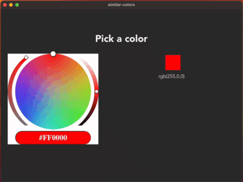

# Similar Colors

A fun project exploring Tauri and USearch to find similar colors.



## About

This application was built as a fun exploration of Rust's Tauri framework and [USearch](https://github.com/unum-cloud/usearch). Select any color from the wheel, and the app instantly shows you similar colors using vector similarity search.

## Technology Stack

- **Frontend**: [React](https://reactjs.org/) with JavaScript
- **Backend**: Rust + [Tauri](https://tauri.app/)
- **Similarity Search**: [USearch](https://github.com/unum-cloud/usearch)

## Development

```bash
# Clone the repository
git clone https://github.com/sattva9/similar-colors.git
cd color-similarity-finder

# Install dependencies
yarn install

# Run in development mode
yarn tauri dev

# Build for production
yarn tauri build
```
